# IBM Cloud Sample

Sample app using IBM Cloud and Microsoft Azure

本リポジトリをクローンした後で、`Watson.NetStandardCore/Secrets_sample.cs` をコピーして `Secrets.cs` として保存し、Watson の資格情報を入力してください。
`NodeRedUrl` には、作成した Node-RED のエンドポイント URL を入力します。

`Azure.NetStandardCore/Secrets.partial_Sample.cs` も同様にコピーして `Secrets.partial.cs` として保存し、`Endpoint` に Logic Apps のエンドポイント URL を入力します。


### Watson Assistant

作成した Watson Assistant にアクセスし `ツールの起動` をクリックします。

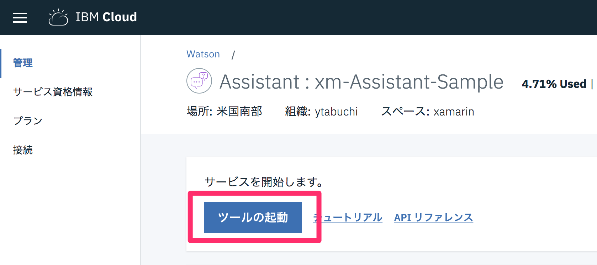

起動したツールで `Workspace` タブの `Create` の右にある `↑` ボタンをクリックします。

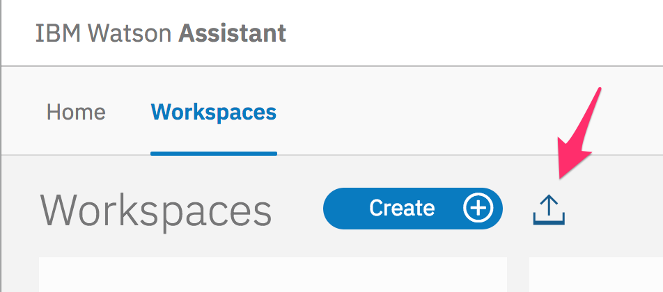

`Watson.json` を選択し、`Import` ボタンをクリックするとインポートされます。

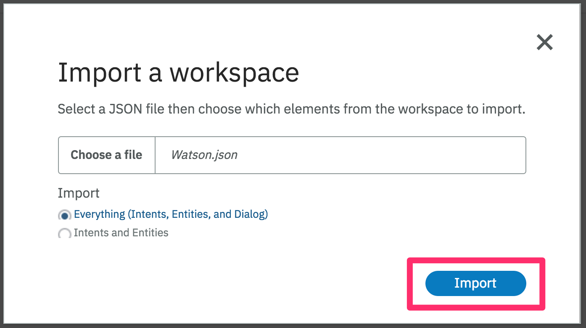

Intent（意図） では認識する文面をグループ化します。

Entities（実体）は今回は使用していませんが、Intent 内の可変項目をリストしてグループ化します。

最後に Dialog でフローを作成します。

今回は3個目の Dialog の `If bot recognizes:` に直接正規表現 `input.text.matches( '([a-zA-Zａ-ｚＡ-Ｚ]+) *の性格(は|を|は？)?(何|教えて)?' )` を記載して「ytabuchiの性格は？」といった文章を拾い、`Then set context:` に `"<? input.text.extract('([a-zA-Zａ-ｚＡ-Ｚ]+) *の性格(は|を)?(何|教えて)?',1) ?>"` を記載して1個目の `()` 内の文言＝今回の例では「ytabuchi」のみを　`$username` 変数に格納し、`And respond with:` に `<? context.username ?>` を記載することで Twitter のユーザー名のみを返答する Bot にしています。

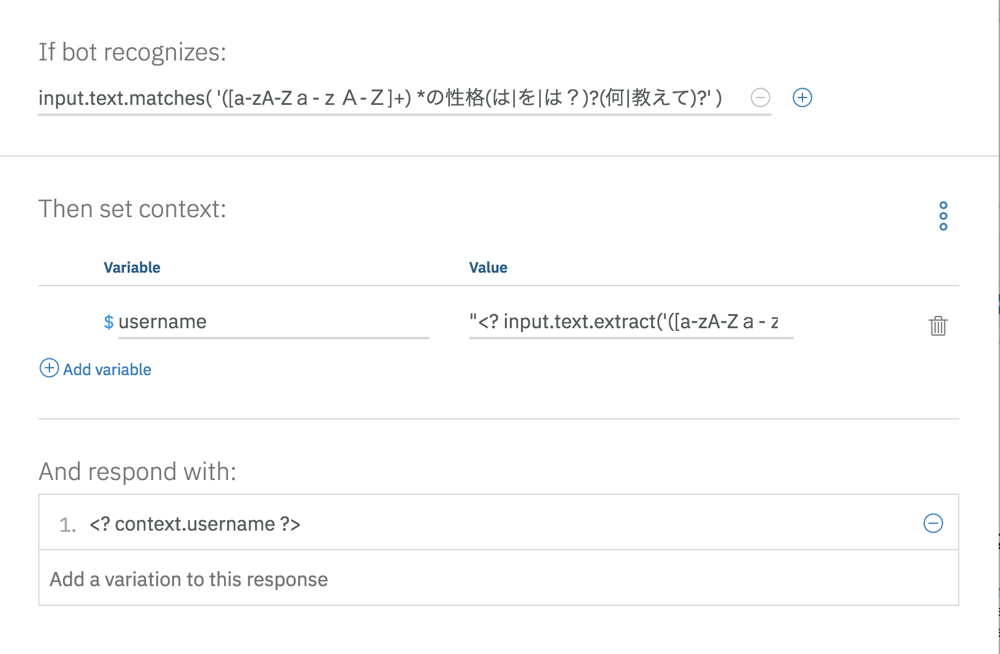

インポートされた Watson の Workspace の右上のボタンをクリックして、`View details` を選択します。

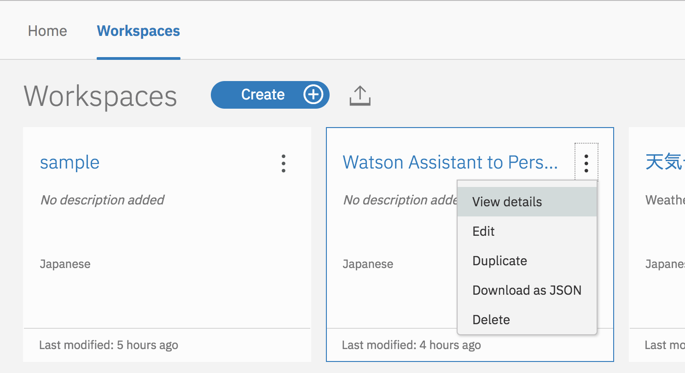

表示される `Workspace ID` をメモしておきます。

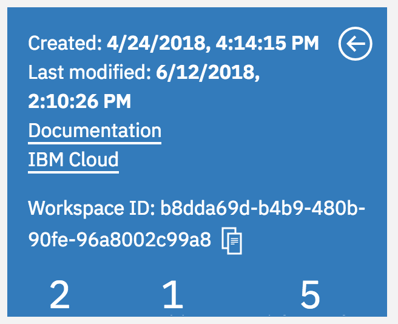


### Node-RED

Node-RED から Personality Insights を呼び出すため、あらかじめサービスを作成しておく必要があります。

Dashboard の `リソースの作成` から「Personality Insights」を選択します。

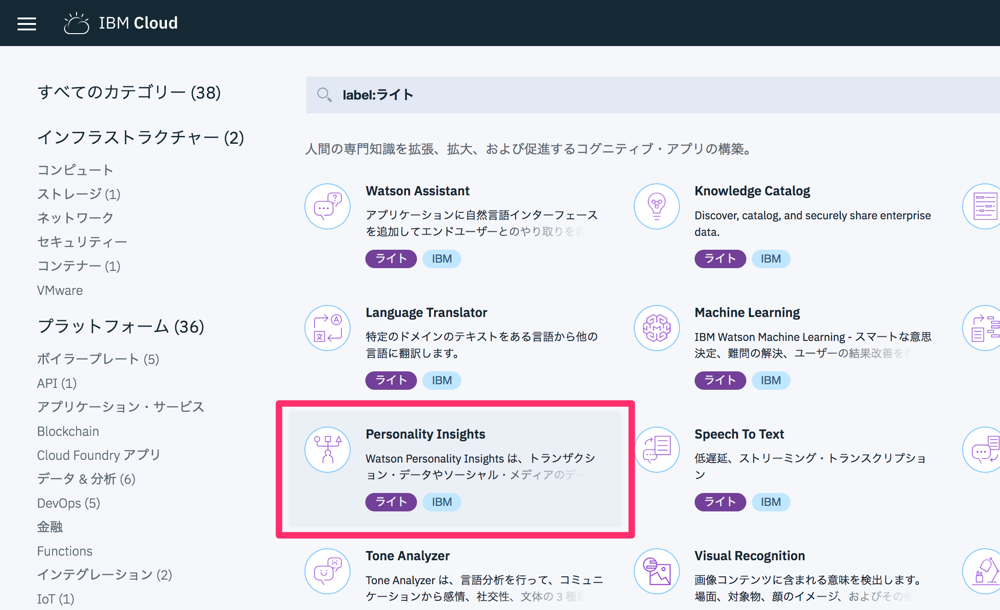

任意のサービス名を記入し、ライトプランであることを確認し、`作成`　ボタンをクリックします。

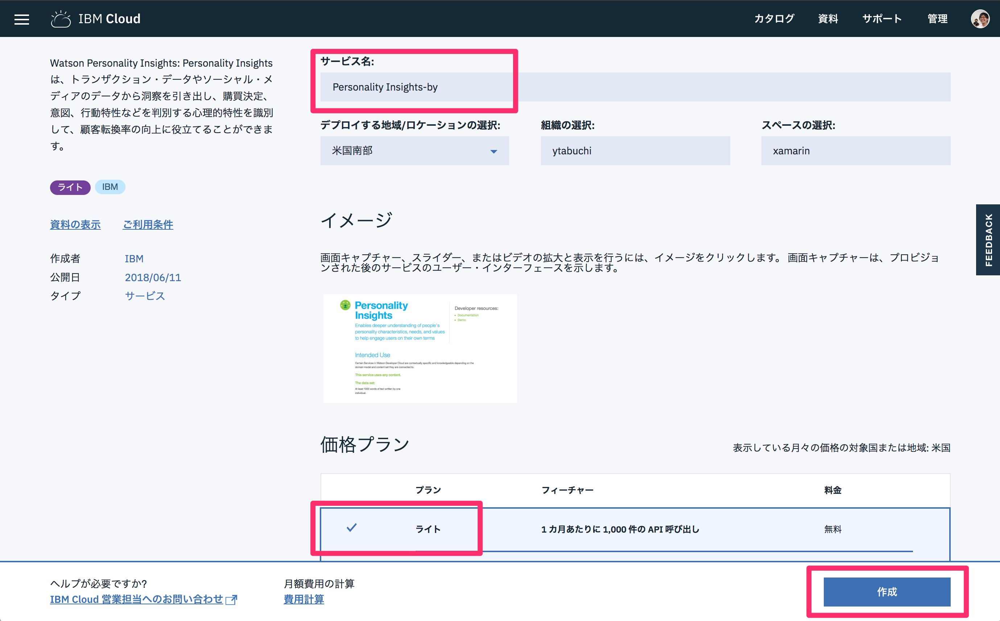

Personality Insights が作成できたら、Node-RED サービスを作成しましょう。

Dashboard の `リソースの作成` から「Node-RED Starter」を選択します。

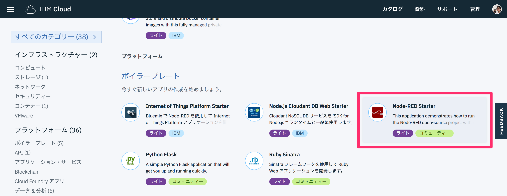

`アプリ名` に任意の名前を入力します。

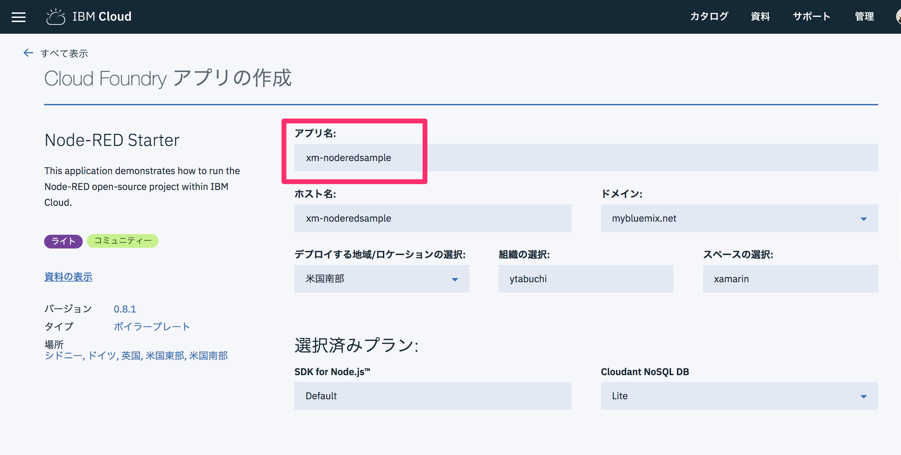

プランを確認し（Node-RED はちょろっとお金がかかるっぽいです…！）、`作成` をクリックします。

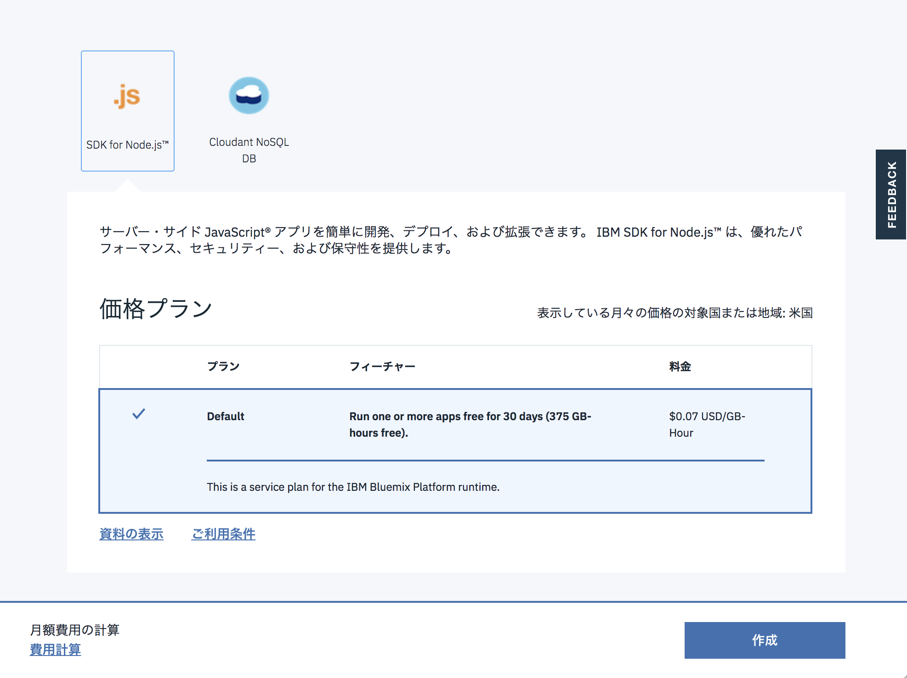

Node-RED で Watson の各サービスのノードを使う場合は、下にスクロールしたところにある `接続` から、アカウントに紐づいているサービスを登録することで

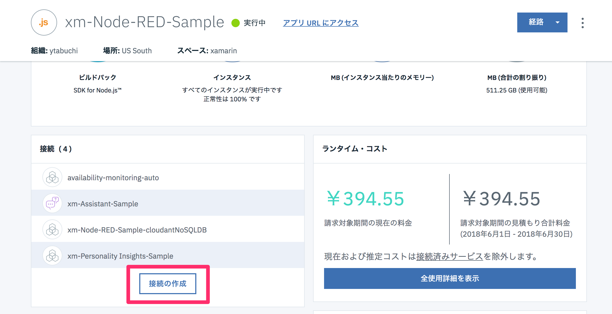

`アプリ URL にアクセス` をクリックします。

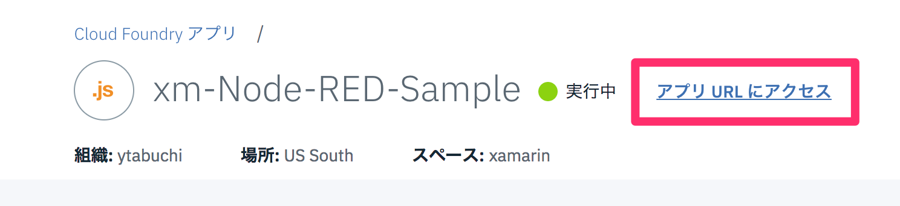

右上の `≡` メニューから `読み込み＞クリップボード` をクリックします。

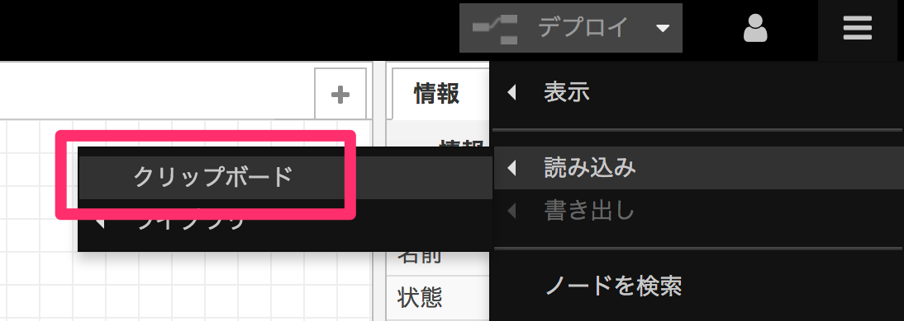

以下のようにワークフローが全て読み込まれます。

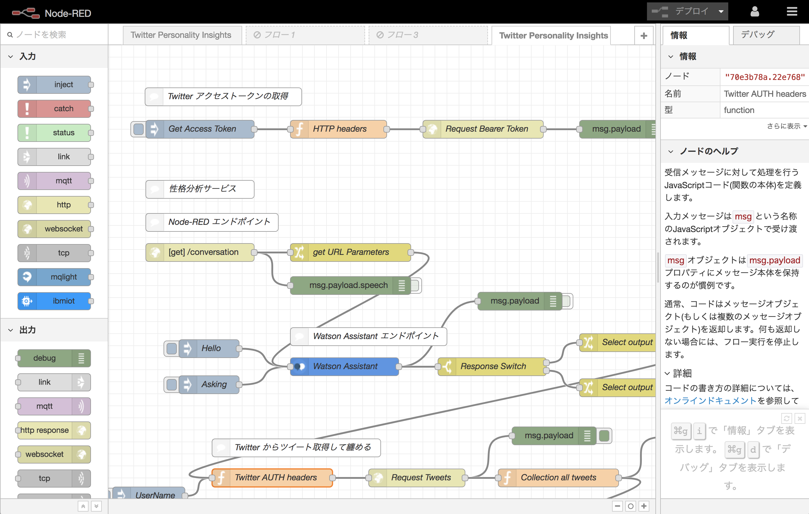

Twitter のツイートを取得するため、Twitter の開発者アカウントが必要です。

https://apps.twitter.com/ にログインし、Twitter アプリを作成してください。

作成したアプリの `Keys and Access Token` タブの「Consumer Key」と「Consumer Secrets」をメモしておきます。

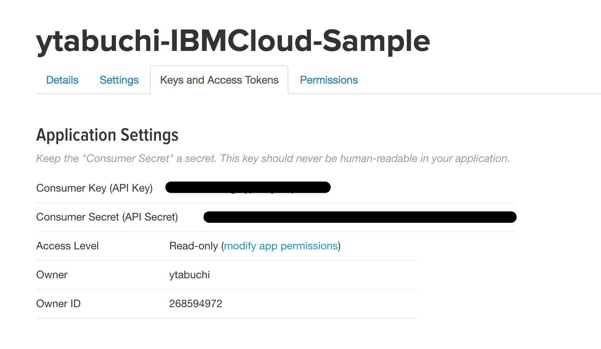

この2つのキーを Base64 エンコードして、「Twitter アクセストークンの取得＞HTTP headers」ノードをダブルクリックして `Basic xxx` の xxx に記入します。

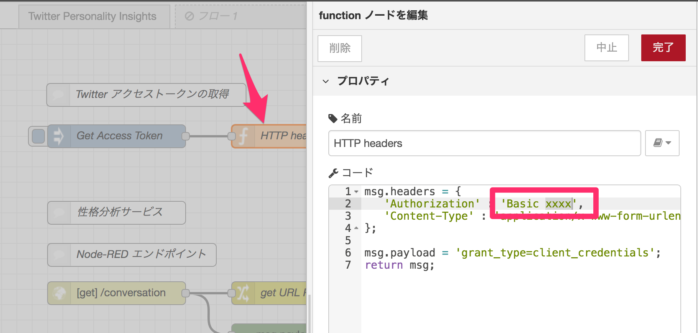

Base64 エンコードされたキーは、https://developer.twitter.com/en/docs/basics/authentication/overview/application-only の「Issuing application-only requests Step 1: Encode consumer key and secret」に書いてありますが、`Consumer Key:Consumer Secrets` と `:` でつなげてエンコードするだけです。

私は http://www.convertstring.com/ja/EncodeDecode/Base64Encode のサイトを利用してエンコードしました。

「Get Access Token」の Inject ノードをクリックすると処理が実行されて、作成した Twitter アプリの Bearer Token を取得できます。`"access_token"` 以下の文字列をメモしておきます。

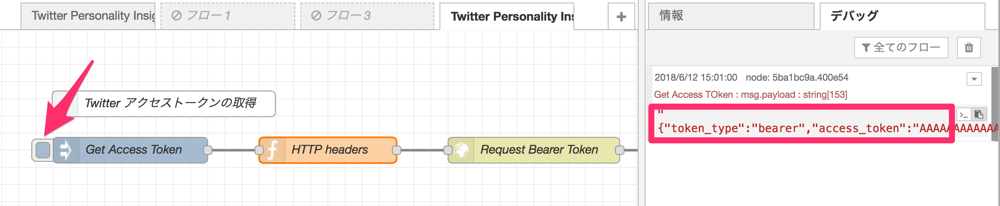

「Twitter からツイートを取得して纏める」パートの `Twitter AUTH headers` ノードをダブルクリックして、`var access_token = 'xxx'` の xxx にメモした Bearer Token で置き換えます。

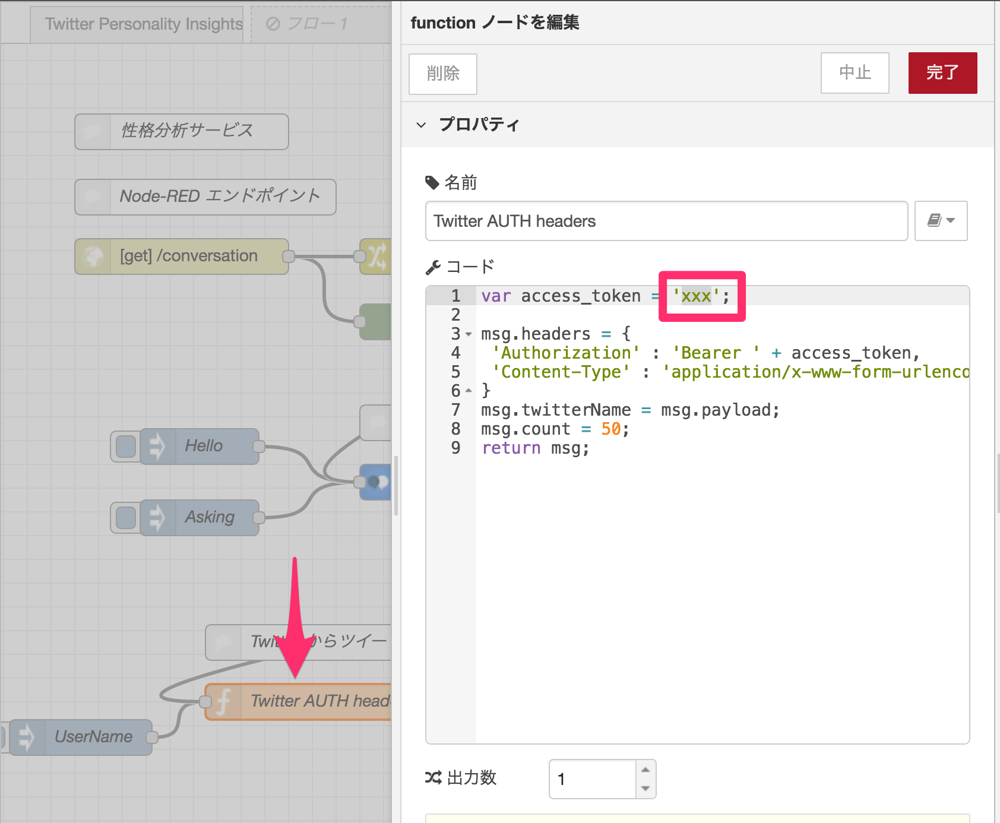

最後に `Watson Assistant` ノードをダブルクリックして、メモしておいた `Workspace ID` を入力します。

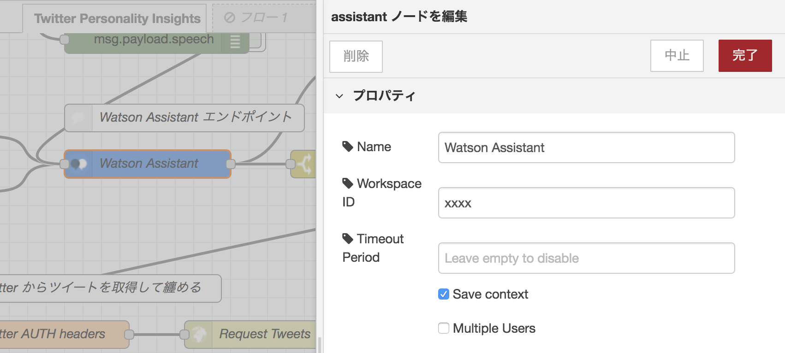

これで動作するようになりましたので、右上の `デプロイ` でデプロイし、ブラウザで `https://<Node-RED アプリ名>.mybluemix.net/conversation?speech=migueldeicazaの性格は？` や、`speech=` に「こんにちは」などを指定してアクセスしてみましょう！


#### その他の TIPS　- JSONata

`Set Personality to Payload` ノードでは、Personality Insights から戻ってきた JSON データを、JSONata で整形しています。

例えば次のように書くと、

```
$join(insights.personality.(name & 'は ' & $round(percentile * 100, 2) & '％です。\n'))
```

以下の JSON の `personality` 以下の子要素の `name` と `percentile` を 100倍して小数点以下2桁で `round` した結果を繋げて、さらに `join` することができます。C# の LINQ みたいな感じですね、凄い！JSONata については公式サイト [JSONata](http://jsonata.org/) をご覧ください。

下のリンクにも記載していますが、[Node\-red\+JSONataでfunction地獄からの卒業](https://www.slideshare.net/kazuhiroharada2/node-redjso-natafunction) に非常に助けられました。ありがとうございます。

```JSON
{
    "word_count": 797,
    "processed_language": "en",
    "personality": [
        {
            "trait_id": "big5_openness",
            "name": "知的好奇心",
            "category": "personality",
            "percentile": 0.9069382737410938,
            "children": [
                {
                    "trait_id": "facet_adventurousness",
                    "name": "大胆性",
                    "category": "personality",
                    "percentile": 0.663692773903994
                },
                {
                    "trait_id": "facet_artistic_interests",
                    "name": "芸術的関心度",
                    "category": "personality",
                    "percentile": 0.73233493053812
                }
            ]
        },
        {
            "trait_id": "big5_conscientiousness",
            "name": "誠実性",
            "category": "personality",
            "percentile": 0.28766730289909126,
            "children": [
                {
                    "trait_id": "facet_achievement_striving",
                    "name": "達成努力",
                    "category": "personality",
                    "percentile": 0.4973241416937628
                },
                {
                    "trait_id": "facet_cautiousness",
                    "name": "注意深さ",
                    "category": "personality",
                    "percentile": 0.6889701792513665
                }
            ]
        }
    ],
    "needs": [
        {
            "trait_id": "need_challenge",
            "name": "挑戦",
            "category": "needs",
            "percentile": 0.141125760269753
        },
        {
            "trait_id": "need_closeness",
            "name": "親密",
            "category": "needs",
            "percentile": 0.022985920977496244
        }
    ],
    "values": [
        {
            "trait_id": "value_conservation",
            "name": "現状維持",
            "category": "values",
            "percentile": 0.04085572357417805
        },
        {
            "trait_id": "value_openness_to_change",
            "name": "変化許容性",
            "category": "values",
            "percentile": 0.2780660599435335
        }
    ],
    "warnings": []
}
```


### 謝辞

Watson、Node-RED のネタをひねり出したり実装するにあたり、[JXUG](http://jxug.org) によく遊びに来てくれる [@Santea3173](https://twitter.com/Santea3173) に色々教えてもらいました。彼の助けがなかったらデモが間に合わなかったと思います。ありがとう！！！

### 参考リンク

上記のネタで Twitter へのアクセスなど、色々なサイトを参考にさせていただきました。ありがとうございました。

[自分にそっくりなteratailの上位ランカーを探してみよう！｜teratail（テラテイル）](https://teratail.com/Bluemix/1)

[Watson Conversationでユーザーの名前だけ抜き出す \- Qiita](https://qiita.com/Ra1nmaker/items/2b00384916ea081bfb16)

[Changeノードを制すものがNode\-REDを制す \- Qiita](https://qiita.com/joeartsea/items/1be1b7f8d08fab04ca73)

[Node\-red\+JSONataでfunction地獄からの卒業](https://www.slideshare.net/kazuhiroharada2/node-redjso-natafunction)
