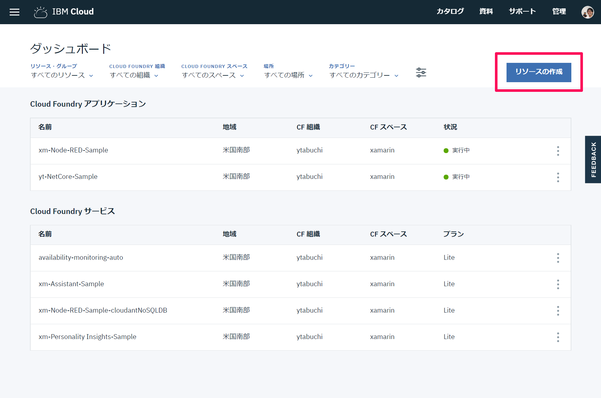
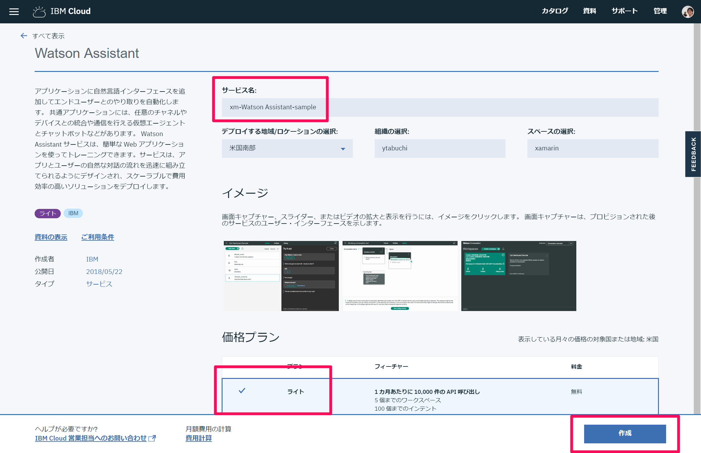

# IBM Cloud and Azure Sample

このリポジトリは Xamarin.Forms で IBM Cloud の Watson や Node-RED、Personality Insights と、Microsoft Azure の Language Understanding（LUIS）や Logic Apps、Text Analytics を使用したチャットアプリを作成するサンプルです。

本リポジトリをクローンした後で、`Watson.NetStandardCore/Secrets_sample.cs` をコピーして `Secrets.cs` として保存し、Watson の資格情報を入力してください。
`NodeRedUrl` には、作成した Node-RED のエンドポイント URL を入力します。

`Azure.NetStandardCore/Secrets.partial_Sample.cs` も同様にコピーして `Secrets.partial.cs` として保存し、`Endpoint` に Logic Apps のエンドポイント URL を入力します。


## IBM Cloud

IBM Cloud を使用した場合の設定方法です。

[`MainPage.xaml.cs`](https://github.com/ytabuchi/IBMCloudSample/blob/master/IBMCloudSample/Watson.XFApp/Watson.XFApp/MainPage.xaml.cs#L1-L3) の `#define` を使用して Watson のみを使用した挨拶だけが出来るチャットアプリ、Node-RED を使用した性格分析が出来るチャットアプリを切り替えることができます。

実行に必要な各サービスについて、以下に作成方法、操作が必要な内容などを記載します。

### 用意するモノ

[IBM Cloud ライト・アカウント](https://www.ibm.com/cloud-computing/jp/ja/bluemix/lite-account/)

大体のことがライトアカウントで出来てしまいます。クレジットカード登録も不要です。素晴らしい！

制限事項として以下がありますので、その点だけご注意ください。ガッと集中してやる分にはまったく問題ないはずです。

- 10日間 開発なしでアプリを自動停止
- 30日間 活動なしでサービスの自動削除
- 「組織の作成」画面では、地域に「米国南部」を選択を行う必要があります。
- 過去にIBM Cloud 30日フリートライアルに登録したメールアドレスは、ライト・アカウントへの登録は行えません。別のメールアドレスにてご登録ください。

アカウントを作成したら、[Dashboard](https://console.bluemix.net/dashboard/apps/) の `リソースの作成` から各種サービスを作成できます。



### Watson Assistant

任意のサービス名でライトプランであることを確認し、Watson Assistant を作成します。



作成した Watson Assistant にアクセスし `ツールの起動` をクリックします。


起動したツールで `Workspace` タブの `Create` の右にある `↑` ボタンをクリックします。


プロジェクトのルートにある `Watson.json` を選択し、`Import` ボタンをクリックするとインポートされます。


Intent（意図） では認識する文面をグループ化します。

Entities（実体）は今回は使用していませんが、Intent 内の可変項目をリストしてグループ化します。

最後に Dialog でフローを作成します。

今回は3個目の Dialog の `If bot recognizes:` に直接正規表現 `input.text.matches( '([a-zA-Zａ-ｚＡ-Ｚ]+) *の性格(は|を|は？)?(何|教えて)?' )` を記載して「ytabuchiの性格は？」といった文章を拾い、`Then set context:` に `"<? input.text.extract('([a-zA-Zａ-ｚＡ-Ｚ]+) *の性格(は|を)?(何|教えて)?',1) ?>"` を記載して1個目の `()` 内の文言＝今回の例では「ytabuchi」のみを　`$username` 変数に格納し、`And respond with:` に `<? context.username ?>` を記載することで Twitter のユーザー名のみを返答する Bot にしています。


インポートされた Watson の Workspace の右上のボタンをクリックして、`View details` を選択します。


表示される `Workspace ID` をメモしておきます。


### Node-RED

Node-RED から Personality Insights を呼び出すため、あらかじめサービスを作成しておく必要があります。

Dashboard の `リソースの作成` から「Personality Insights」を選択します。


任意のサービス名を記入し、ライトプランであることを確認し、`作成`　ボタンをクリックします。


Personality Insights が作成できたら、Node-RED サービスを作成しましょう。

Dashboard の `リソースの作成` から「Node-RED Starter」を選択します。


`アプリ名` に任意の名前を入力します。


ライトプランであることを確認し `作成` をクリックします。


> 写真では Default プランしかありませんが、私が従量課金プラン（PAYG）を使用しているためでライトプランでは完全無料でお使いいただけます。プランの種類、金額などは [IBM Cloud料金設定](https://www.ibm.com/cloud-computing/bluemix/ja/pricing) をご覧ください。

Node-RED で Watson の各サービスのノードを使う場合は、下にスクロールしたところにある `接続の作成` から、アカウントに紐づいているサービスを登録することで資格情報の入力を省略できます。作成した Watson Assistant と Personality Insights を接続してください。


接続が完了したら、`アプリ URL にアクセス` をクリックします。


右上の `≡` メニューから `読み込み＞クリップボード` をクリックします。


以下のように Node-RED のワークフローが全て読み込まれます。


このフローでは、指定した Twitter アカウントのツイートを取得するため、Twitter の開発者アカウントが必要です。

https://apps.twitter.com/ にログインし、Twitter アプリを作成してください。

作成したアプリの `Keys and Access Token` タブの「Consumer Key」と「Consumer Secrets」をメモしておきます。


この2つのキーを Base64 エンコードして、「Twitter アクセストークンの取得＞HTTP headers」ノードをダブルクリックして `Basic xxx` の xxx に記入します。


Base64 エンコードされたキーは、https://developer.twitter.com/en/docs/basics/authentication/overview/application-only の「Issuing application-only requests Step 1: Encode consumer key and secret」に書いてありますが、`Consumer Key:Consumer Secrets` と `:` でつなげてエンコードして作成します。

私は http://www.convertstring.com/ja/EncodeDecode/Base64Encode のサイトを利用してエンコードしました。

「Get Access Token」の Inject ノードをクリックすると処理が実行されて、作成した Twitter アプリの Bearer Token を取得できます。`"access_token"` 以下の文字列をメモしておきます。


「Twitter からツイートを取得して纏める」パートの `Twitter AUTH headers` ノードをダブルクリックして、`var access_token = 'xxx'` の xxx にメモした Bearer Token で置き換えます。


最後に `Watson Assistant` ノードをダブルクリックして、メモしておいた `Workspace ID` を入力します。


これで動作するようになりましたので、右上の `デプロイ` でデプロイし、ブラウザで `https://<Node-RED アプリ名>.mybluemix.net/conversation?speech=migueldeicazaの性格は？` や、`speech=` に「こんにちは」などを指定してアクセスしてみましょう！


#### その他の TIPS　- JSONata

`Set Personality to Payload` ノードでは、Personality Insights から戻ってきた JSON データを、JSONata で整形しています。

例えば次のように書くと、

```
$join(insights.personality.(name & 'は ' & $round(percentile * 100, 2) & '％です。\n'))
```

以下の JSON の `personality` 以下の子要素の `name` と `percentile` を 100倍して小数点以下2桁で `round` した結果を繋げて、さらに `join` することができます。C# の LINQ みたいな感じですね、凄い！JSONata については公式サイト [JSONata](http://jsonata.org/) をご覧ください。

下のリンクにも記載していますが、[Node\-red\+JSONataでfunction地獄からの卒業](https://www.slideshare.net/kazuhiroharada2/node-redjso-natafunction) に非常に助けられました。ありがとうございます。

```JSON
{
    "word_count": 797,
    "processed_language": "en",
    "personality": [
        {
            "trait_id": "big5_openness",
            "name": "知的好奇心",
            "category": "personality",
            "percentile": 0.9069382737410938,
            "children": [
                {
                    "trait_id": "facet_adventurousness",
                    "name": "大胆性",
                    "category": "personality",
                    "percentile": 0.663692773903994
                },
                {
                    "trait_id": "facet_artistic_interests",
                    "name": "芸術的関心度",
                    "category": "personality",
                    "percentile": 0.73233493053812
                }
            ]
        },
        {
            "trait_id": "big5_conscientiousness",
            "name": "誠実性",
            "category": "personality",
            "percentile": 0.28766730289909126,
            "children": [
                {
                    "trait_id": "facet_achievement_striving",
                    "name": "達成努力",
                    "category": "personality",
                    "percentile": 0.4973241416937628
                },
                {
                    "trait_id": "facet_cautiousness",
                    "name": "注意深さ",
                    "category": "personality",
                    "percentile": 0.6889701792513665
                }
            ]
        }
    ],
    "needs": [
        {
            "trait_id": "need_challenge",
            "name": "挑戦",
            "category": "needs",
            "percentile": 0.141125760269753
        },
        {
            "trait_id": "need_closeness",
            "name": "親密",
            "category": "needs",
            "percentile": 0.022985920977496244
        }
    ],
    "values": [
        {
            "trait_id": "value_conservation",
            "name": "現状維持",
            "category": "values",
            "percentile": 0.04085572357417805
        },
        {
            "trait_id": "value_openness_to_change",
            "name": "変化許容性",
            "category": "values",
            "percentile": 0.2780660599435335
        }
    ],
    "warnings": []
}
```


### 謝辞

Watson、Node-RED のネタをひねり出したり実装するにあたり、[JXUG](http://jxug.org) によく遊びに来てくれる [@Santea3173](https://twitter.com/Santea3173) に色々教えてもらいました。彼の助けがなかったらデモが間に合わなかったと思います。ありがとう！！！

### 参考リンク

上記のネタで Twitter へのアクセスや Personality Insights への繋ぎ方、データの取得方法など、色々なサイトを参考にさせていただきました。ありがとうございました。

[自分にそっくりなteratailの上位ランカーを探してみよう！｜teratail（テラテイル）](https://teratail.com/Bluemix/1)

[Watson Conversationでユーザーの名前だけ抜き出す \- Qiita](https://qiita.com/Ra1nmaker/items/2b00384916ea081bfb16)

[Changeノードを制すものがNode\-REDを制す \- Qiita](https://qiita.com/joeartsea/items/1be1b7f8d08fab04ca73)

[Node\-red\+JSONataでfunction地獄からの卒業](https://www.slideshare.net/kazuhiroharada2/node-redjso-natafunction)
